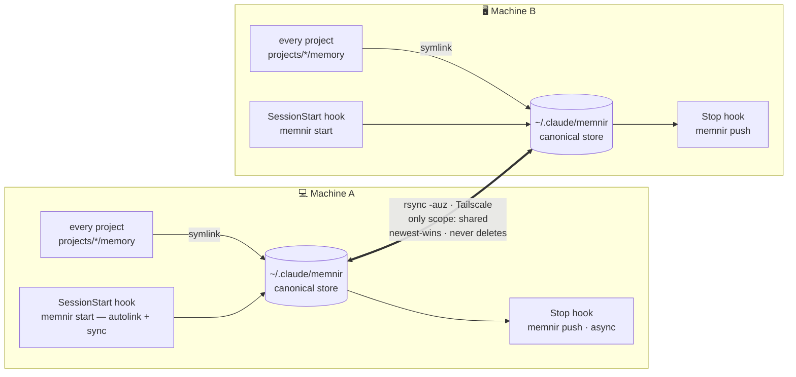

#  Memnir

*memory + [Mímir](https://en.wikipedia.org/wiki/M%C3%ADmir)* — share [Claude Code](https://docs.claude.com/en/docs/claude-code) memory **across machines** and **across every session**, peer-to-peer over [Tailscale](https://tailscale.com). No cloud.

> 🇹🇭 [อ่านภาษาไทย](README.th.md)

Claude Code stores memory per-project under `~/.claude/projects/<encoded-path>/memory/`, tied to one machine and one working directory — open another machine or another project and none of it follows you. Memnir unifies it into **one pool** that every session on every machine reads and writes, and syncs only the memories you choose between machines.

## Architecture



1. **Store** — `~/.claude/memnir/`, the single place real memory files live on each machine.
2. **Symlink** — every project's `memory/` dir points here, so all sessions share one pool.
3. **Sync** — two-way `rsync` between machines over Tailscale, filtered by scope.

## Install

Memnir is a single **Rust binary** (pure std, no external crates). On each machine:

```bash
git clone https://github.com/MegaWiz-Dev-Team/memnir
cd memnir
./install.sh
```

`install.sh` builds with `cargo build --release`, installs the binary to `~/.local/bin/memnir`, adds shell aliases (`memnir` and the short `mn`), symlinks all existing projects into the pool, installs the auto-sync hooks, and asks for the peer(s).

> No `cargo` on a machine but same arch (Apple Silicon)? Build once and copy the binary: `scp target/release/memnir other-mac:.local/bin/`. `install.sh` falls back to a prebuilt binary if `cargo` is missing.

### Configure peers (mesh)

Each machine lists **every other machine** — one `user@tailscale-host` per line. For 2 machines that's a single line each; for N machines it's a full mesh.

```bash
# on machine A — list B and C:
printf '%s\n' 'you@mac-b' 'you@mac-c' > ~/.claude/memnir.conf
# or:  export MEMNIR_PEER="you@mac-b,you@mac-c"
```

`push`/`pull` fan out to every peer (newest-wins, never deletes). No host data is baked into the binary. Each pair needs SSH key auth + Remote Login in both directions.

### Origin tracking

Each memory carries `metadata.origin: <hostname>` — the machine that first wrote it. Memnir stamps new memories before they push; pre-existing ones are grandfathered as `?` (unknown). See where memory comes from in `memnir status` / `doctor` (an `origins:` breakdown), in `memnir list` (origin shown per shared memory), and in the dashboard's **Origins** panel + each node's tooltip (`· from <machine>`).

## Usage

### Normally: nothing

After `./install.sh`, Memnir runs **automatically every session** via hooks: opening Claude pulls the latest memory and links the current project into the pool; when Claude writes a memory, it's pushed to the peer right after the turn.

### When you want to act

```bash
memnir share project_firestore_envs   # mark a memory shared (default is local) + push
memnir local debug_scratch_today      # un-share → back to local (no sync)
memnir list                           # which memories are shared vs local
memnir sync                           # manual two-way sync (hooks do this for you)
memnir doctor                         # health report: token footprint, issues, actions
memnir dash && open ~/.claude/memnir/dashboard.html   # knowledge-graph + token dashboard
memnir link                           # link the current project into the pool right now
```

### What `memnir doctor` shows

```
MEMNIR HEALTH ───────────────────────────────── your-laptop
inventory   231 memories   project:174  feedback:36  reference:21
scope       shared:195   local:36
origins     your-laptop:140  other-mac:60  ?:31
tokens      index ~15.0k/session 🔴   pool ~195k
peers       2 (reachable 2)   drift: 0 files

⚠ ISSUES & ACTIONS
 🔴 index 15k always-on        → compact-index (Tier-0 split)
 🟠 21 broken [[links]]          → memnir fix-links
 🟡 66 isolated memories       → link them (graph: memnir dash)
```

### Command reference

| command | what it does |
|---|---|
| `memnir sync` | push + pull `scope: shared` only, then regenerate the index |
| `memnir push` / `pull` | one direction (shared only) |
| `memnir share <id>` | set a memory `scope: shared` and push it to the peers |
| `memnir local <id>` | remove the tag → local again (won't sync) |
| `memnir list` | list shared vs local memories (shared show their origin machine) |
| `memnir search <q> [--expand]` | keyword search (name/desc/body ranked); `--expand` also pulls in `[[link]]`-related memories |
| `memnir related <id> [--depth N]` | memories connected to `<id>` via `[[links]]` (BFS, default depth 2) |
| `memnir status` | store path, counts, origins, peers |
| `memnir help` | list all commands (also `-h` / `--help`) |
| `memnir start` | autolink current project + sync (run by the SessionStart hook) |
| `memnir link` | manually symlink the current project into the pool |
| `memnir doctor [--check]` | health report + actions (`--check` = quiet unless there's an issue; for hooks) |
| `memnir dash` | write a static `dashboard.html` (knowledge graph + token visualization) |
| `memnir serve [--port N]` | **interactive** dashboard on `127.0.0.1` — click a node to toggle shared/local, buttons to sync |

### Interactive dashboard

`memnir serve` runs a tiny localhost HTTP server (pure std) and opens the dashboard in your browser. Unlike the static `dash`, it can run commands:

- **click any node** → toggle that memory between shared / local (and push if it became shared)
- **⟳ Sync** button → two-way sync with the peer
- **Refresh** → reload with fresh data

Bound to `127.0.0.1` only, guarded by a random per-session token in the URL. Stop with `Ctrl-C`.

`<id>` is a memory name, with or without `.md`. Every command also works via the short **`mn`** alias (e.g. `mn doctor`).

## Search

Three ways to find a memory — all instant (the pool is scanned in memory; no index/DB):

- **`memnir search <q>`** — keyword search ranked by where it hits (name/desc > body). Add `--expand` to also surface memories that are `[[link]]`-connected to the hits, even without a keyword match — so search reaches related notes when your words don't line up.
- **`memnir related <id>`** — walk the `[[links]]` graph from a memory (BFS, `--depth N`).
- **Dashboard** (`memnir serve`/`dash`) — a search box highlights matching nodes and zooms to them; selecting a node lights up its links.
- **`/recall <q>`** — a Claude Code slash command (installed by `install.sh` to `~/.claude/commands/`): runs `search --expand`, then Claude reads the top hit and answers, grounded in it.

## Scope: shared vs local 🔑

Memnir syncs **only memories you intend to share across machines**, not everything. Controlled by a frontmatter field:

```yaml
---
name: project_firestore_envs
metadata:
  type: project
  scope: shared      # <- this line = sync across machines
---
```

- **`scope: shared`** → synced both ways over Tailscale.
- **no `scope`** (default) → **local**; stays on this machine only.
- `MEMORY.md` (the index) is **never synced** — it's regenerated on each machine from the files that are actually present, so local memory titles never leak across machines.
- Toggle anytime: `memnir share <id>` / `memnir local <id>`.

Sync is filtered with `rsync --files-from=<list of scope:shared files>` — local files are never transmitted.

## Sync design

- `rsync -auz`: `-u` skips files newer on the receiver (**newest-wins**); **no `--delete`**, so files are never removed across machines (safe, but deletions must be done on both sides).
- Whatever was in a project's `memory/` before linking is backed up as `memory.bak.<ts>`.
- Logs at `~/.claude/memnir.log`.

## Requirements (macOS)

> ⚠️ **Supported on macOS only.** The binary relies on Unix symlinks, `/dev/urandom`, and `hostname -s`, and the setup assumes `rsync` + `zsh` + Remote Login + the Tailscale Mac app.
>
> **Other platforms:** a Linux / **WSL2** machine can join the mesh with small tweaks (the Rust core is mostly POSIX — only the `open` browser call is Mac-specific). **Native Windows** is not supported yet — it would need a port (symlinks → junctions, bundled `rsync`, `COMPUTERNAME`/`USERPROFILE`). Note that to share with a WSL node, Claude Code must also run inside WSL so its memory lives at the WSL `~/.claude`.

| need | notes |
|---|---|
| **macOS** | Intel or Apple Silicon |
| **Rust / cargo** | to build (`rustup` or `brew install rust`) — or copy a prebuilt binary between same-arch machines |
| **zsh** | default macOS shell; the `memnir` alias goes in `~/.zshrc` |
| **rsync + ssh** | ship with macOS |
| **python3** | used by `install.sh` to merge hooks into `settings.json` (ships with Command Line Tools — `xcode-select --install`) |
| **[Tailscale](https://tailscale.com)** | the **Mac app** on both machines, on the same tailnet |
| **Remote Login** | enable on the machine you sync *to*: System Settings → General → Sharing → Remote Login (enable on both for two-way) |
| **SSH key auth** | passwordless between every pair, both directions (`ssh-keygen` + the public key in the other machine's `~/.ssh/authorized_keys`) |
| **peers** | `~/.claude/memnir.conf` — one `user@tailscale-host` per line (mesh: list every other machine) — or env `MEMNIR_PEER` |

**macOS notes:**
- `systemsetup -setremotelogin on` needs the terminal to have Full Disk Access — the GUI toggle (Sharing) is easier and needs no FDA.
- Tailscale **SSH server (`tailscale up --ssh`) is Linux-only** — on macOS use regular Remote Login (OpenSSH `sshd`).

## Project layout

- [`src/main.rs`](src/main.rs) — all of Memnir (pure std)
- [`Cargo.toml`](Cargo.toml)
- [`install.sh`](install.sh) — build + bootstrap a machine into the mesh
- `.gitignore` (ignores `/target`, `dashboard.html`, `*.log`)

## License

[MIT](LICENSE)
