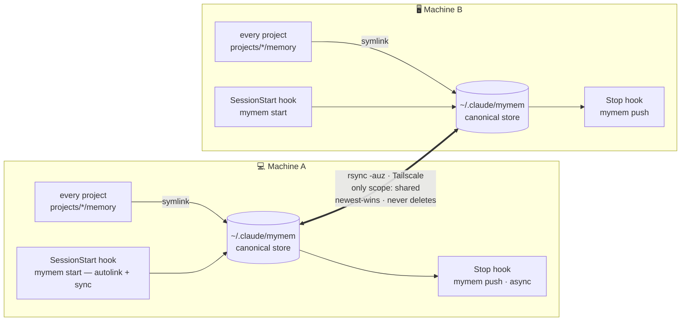

#  MyMem

[](https://github.com/MegaWiz-Dev-Team/mymem/releases)
[](LICENSE)


*my memory, everywhere* — share [Claude Code](https://docs.claude.com/en/docs/claude-code) memory **across machines** and **across every session**, peer-to-peer over [Tailscale](https://tailscale.com). No cloud.

> 🇹🇭 [อ่านภาษาไทย](README.th.md)

Claude Code stores memory per-project under `~/.claude/projects/<encoded-path>/memory/`, tied to one machine and one working directory — open another machine or another project and none of it follows you. MyMem unifies it into **one pool** that every session on every machine reads and writes, and syncs only the memories you choose between machines.

## Architecture



1. **Store** — `~/.claude/mymem/`, the single place real memory files live on each machine.
2. **Symlink** — every project's `memory/` dir points here, so all sessions share one pool.
3. **Sync** — two-way `rsync` between machines over Tailscale, filtered by scope.

## Install

MyMem is a single **Rust binary** (pure std, no external crates). On each machine:

```bash
git clone https://github.com/MegaWiz-Dev-Team/mymem
cd mymem
./install.sh
```

`install.sh` builds with `cargo build --release`, installs the binary to `~/.local/bin/mymem`, adds shell aliases (`mymem` and the short `mn`), symlinks all existing projects into the pool, installs the auto-sync hooks, and asks for the peer(s).

> No `cargo` on a machine but same arch (Apple Silicon)? Build once and copy the binary: `scp target/release/mymem other-mac:.local/bin/`. `install.sh` falls back to a prebuilt binary if `cargo` is missing.

Each release attaches prebuilt binaries for **macOS** (arm64 + Intel) and **Linux x86_64** (what WSL2 uses) — see [Releases](https://github.com/MegaWiz-Dev-Team/mymem/releases). `install.sh` runs a **preflight** first and, if a prerequisite is missing, exits without changing anything and prints exactly what to install.

### Linux / WSL2

The Rust core is POSIX and builds natively on WSL2 (Ubuntu). `install.sh` detects WSL2, wires the alias into `~/.bashrc` instead of `~/.zshrc`, and shells out to the same `rsync`/`ssh`.

```bash
# one-time toolchain (Ubuntu/Debian under WSL2):
sudo apt-get update && sudo apt-get install -y rsync openssh-client python3 build-essential
curl --proto '=https' --tlsv1.2 -sSf https://sh.rustup.rs | sh -s -- -y && . "$HOME/.cargo/env"

git clone https://github.com/MegaWiz-Dev-Team/mymem && cd mymem
./install.sh
```

> ⚠️ **Run Claude Code *inside* WSL2.** MyMem manages `~/.claude/mymem` in the WSL home. The Windows desktop app stores memory at `C:\Users\<you>\.claude` (`/mnt/c/Users/<you>/.claude` from WSL) — that path is **not** bridged, so hooks installed from WSL would target the wrong `settings.json`. `install.sh` warns if it detects this case.

### Configure peers (mesh)

Each machine lists **every other machine** — one `user@tailscale-host` per line. For 2 machines that's a single line each; for N machines it's a full mesh.

```bash
# on machine A — list B and C:
printf '%s\n' 'you@mac-b' 'you@mac-c' > ~/.claude/mymem.conf
# or:  export MYMEM_PEER="you@mac-b,you@mac-c"
```

`push`/`pull` fan out to every peer (newest-wins, never deletes). No host data is baked into the binary. Each pair needs SSH key auth + Remote Login in both directions.

### Origin tracking

Each memory carries `metadata.origin: <hostname>` — the machine that first wrote it. MyMem stamps new memories before they push; pre-existing ones are grandfathered as `?` (unknown). See where memory comes from in `mymem status` / `doctor` (an `origins:` breakdown), in `mymem list` (origin shown per shared memory), and in the dashboard's **Origins** panel + each node's tooltip (`· from <machine>`).

## Usage

### Normally: nothing

After `./install.sh`, MyMem runs **automatically every session** via hooks: opening Claude pulls the latest memory and links the current project into the pool; when Claude writes a memory, it's pushed to the peer right after the turn.

### When you want to act

```bash
mymem share project_firestore_envs   # mark a memory shared (default is local) + push
mymem local debug_scratch_today      # un-share → back to local (no sync)
mymem list                           # which memories are shared vs local
mymem sync                           # manual two-way sync (hooks do this for you)
mymem doctor                         # health report: token footprint, issues, actions
mymem dash && open ~/.claude/mymem/dashboard.html   # knowledge-graph + token dashboard
mymem link                           # link the current project into the pool right now
```

### What `mymem doctor` shows

```
MYMEM HEALTH ───────────────────────────────── your-laptop
inventory   231 memories   project:174  feedback:36  reference:21
scope       shared:195   local:36
origins     your-laptop:140  other-mac:60  ?:31
tokens      index ~15.0k/session 🔴   pool ~195k
peers       2 (reachable 2)   drift: 0 files

⚠ ISSUES & ACTIONS
 🔴 index 15k always-on        → mymem compact-index   (Tier-0 split)
 🟠 21 broken [[links]]          → mymem fix-links
 🟡 66 isolated memories       → link them (graph: mymem dash)
```

Every action above is a real command — run it to clear the flag. See [Token footprint](#token-footprint-) below.

### Command reference

| command | what it does |
|---|---|
| `mymem sync` | push + pull `scope: shared` only, then regenerate the index |
| `mymem push` / `pull` | one direction (shared only) |
| `mymem share <id>` | set a memory `scope: shared` and push it to the peers |
| `mymem local <id>` | remove the tag → local again (won't sync) |
| `mymem list` | list shared vs local memories (shared show their origin machine) |
| `mymem reserve <repo> [<version>\|--patch\|--minor\|--major] [desc]` | claim a version before a new feature/issue (see [Version reservation](#version-reservation-)); no version/flag → next minor |
| `mymem reservations [repo] [--all]` | list active reservations (grouped by repo, with owner/age/desc), flagging collisions |
| `mymem release <repo> <version>` | free your reservation when the work has shipped |
| `mymem search <q> [--expand]` | keyword search (name/desc/body ranked); `--expand` also pulls in `[[link]]`-related memories |
| `mymem related <id> [--depth N]` | memories connected to `<id>` via `[[links]]` (BFS, default depth 2) |
| `mymem status` | store path, counts, origins, peers |
| `mymem help` | list all commands (also `-h` / `--help`) |
| `mymem start` | autolink current project + sync (run by the SessionStart hook) |
| `mymem link` | manually symlink the current project into the pool |
| `mymem doctor [--check]` | health report + actions (`--check` = quiet unless there's an issue; for hooks) |
| `mymem compact-index [types] [--off]` | cap the always-on index — keep only Tier-0 types in `MEMORY.md`, spill the rest to `MEMORY.full.md` (see [Token footprint](#token-footprint-)) |
| `mymem fix-links [--apply]` | repair broken `[[links]]` that have one unambiguous target (dry-run unless `--apply`) |
| `mymem autolink` | symlink the current project into the pool, quietly (no output if already linked; used by the hook) |
| `mymem dash` | write a static `dashboard.html` (knowledge graph + token visualization) |
| `mymem serve [--port N]` | **interactive** dashboard on `127.0.0.1` — click a node to toggle shared/local, buttons to sync |

### Interactive dashboard

`mymem serve` runs a tiny localhost HTTP server (pure std) and opens the dashboard in your browser. Unlike the static `dash`, it can run commands:

- **click any node** → toggle that memory between shared / local (and push if it became shared)
- **⟳ Sync** button → two-way sync with the peer
- **Refresh** → reload with fresh data

Bound to `127.0.0.1` only, guarded by a random per-session token in the URL. Stop with `Ctrl-C`.

`<id>` is a memory name, with or without `.md`. Every command also works via the short **`mn`** alias (e.g. `mn doctor`).

## Search

Three ways to find a memory — all instant (the pool is scanned in memory; no index/DB):

- **`mymem search <q>`** — keyword search ranked by where it hits (name/desc > body). Add `--expand` to also surface memories that are `[[link]]`-connected to the hits, even without a keyword match — so search reaches related notes when your words don't line up.
- **`mymem related <id>`** — walk the `[[links]]` graph from a memory (BFS, `--depth N`).
- **Dashboard** (`mymem serve`/`dash`) — a search box highlights matching nodes and zooms to them; selecting a node lights up its links.
- **`/recall <q>`** — a Claude Code slash command (installed by `install.sh` to `~/.claude/commands/`): runs `search --expand`, then Claude reads the top hit and answers, grounded in it.

## Scope: shared vs local 🔑

MyMem syncs **only memories you intend to share across machines**, not everything. Controlled by a frontmatter field:

```yaml
---
name: project_firestore_envs
metadata:
  type: project
  scope: shared      # <- this line = sync across machines
---
```

- **`scope: shared`** → synced both ways over Tailscale.
- **no `scope`** (default) → **local**; stays on this machine only.
- `MEMORY.md` (the index) is **never synced** — it's regenerated on each machine from the files that are actually present, so local memory titles never leak across machines.
- Toggle anytime: `mymem share <id>` / `mymem local <id>`.

Sync is filtered with `rsync --files-from=<list of scope:shared files>` — local files are never transmitted.

## Token footprint 🪙

Only **one thing is always-on**: `MEMORY.md`, the index — Claude Code loads it into context every session. Everything else (the memory bodies, the whole pool) is **on-demand**: `mymem search` scans the files directly, so the full catalog costs **zero tokens** until you actually query it.

`MEMORY.md` carries one line per memory, so it grows with the pool — at a few hundred memories it can dominate your always-on context. `mymem doctor` flags it 🔴 past ~12k tokens. Two commands keep it lean:

### `mymem compact-index` — Tier-0 split

Splits the index into a small always-on tier and an on-demand catalog:

```bash
mymem compact-index            # MEMORY.md = only user + feedback memories
mymem compact-index user feedback project   # custom Tier-0 types
mymem compact-index --off      # restore the full index
```

- `MEMORY.md` keeps only **Tier-0** memories (default `user,feedback` — the ones worth carrying every session).
- The full catalog moves to `MEMORY.full.md` — **not auto-loaded**, but still on disk and **fully searchable** (`search` works on the pool, not the index, so nothing becomes unreachable).
- Reversible any time with `--off`; the index is always regenerated from the actual memory files, so no data is ever lost. `MEMORY.full.md` is local-only (never synced, like `MEMORY.md`).

The active Tier-0 is remembered in a `.index_compact` marker, so `sync`/`pull`/`share` keep regenerating the compact form instead of re-expanding it.

### `mymem fix-links` — repair broken `[[links]]`

```bash
mymem fix-links            # dry-run: list broken links + proposed fixes
mymem fix-links --apply    # rewrite the unambiguous ones
```

A `[[link]]` is "broken" when no memory matches it. `fix-links` only rewrites a link when exactly **one** memory is an unambiguous normalized-substring match — typos and genuine forward-references (a `[[name]]` for a memory you haven't written yet) are listed but **left untouched**.

## Version reservation 🔖

When several sessions (the same Mac, or different machines on the mesh) work the **same repo** concurrently, two of them can independently pick "the next version" and collide. Reserve one **before** you start a new feature/issue so every session sees what's in flight:

```bash
mymem reserve Mimir "OCR retry queue"      # → next MINOR (e.g. 0.5.0)
mymem reserve Mimir --patch "fix index"    # → next PATCH
mymem reserve heimdall 2.4.0 "tool-call"   # → an explicit version
mymem reservations                          # who holds what (⚠ flags collisions)
mymem release Mimir 0.5.0                    # free it when the work ships
```

`reserve` with no version/flag picks the next **minor**; `--patch` / `--major` (and `--next`, an alias for `--minor`) choose the bump. An explicit version another machine already holds is **refused**.

Each reservation is its **own `scope: shared` file** (with a short random tag), so claims sync independently with no newest-wins clobber — and a same-version double-claim survives as two files and is **surfaced as a `COLLISION`** (in `reservations` and `doctor`) instead of silently lost. This is **best-effort coordination, not a distributed lock**: the sync window can still race, but races are made visible, not hidden. `release` marks a reservation `status: released` (a tombstone — the sync model never deletes). Reservation records are kept out of the always-on index, `list`, and the dashboard graph; `doctor` / `status` report active-reservation and collision counts.

## Sync design

- `rsync -auz`: `-u` skips files newer on the receiver (**newest-wins**); **no `--delete`**, so files are never removed across machines (safe, but deletions must be done on both sides).
- Whatever was in a project's `memory/` before linking is backed up as `memory.bak.<ts>`.
- Logs at `~/.claude/mymem.log`.

## Requirements (macOS / WSL2)

> ✅ **macOS and Linux / WSL2** are supported — `install.sh` detects the platform and picks the right shell rc, dependencies, and binary. See [Linux / WSL2](#linux--wsl2) above. The binary relies on Unix symlinks, `/dev/urandom`, and `hostname`, plus `rsync` + `ssh` + Tailscale for sync.
>
> ⚠️ **Native Windows** is not supported yet — `src/main.rs` uses `std::os::unix::fs::symlink` unconditionally and won't compile there; it would need a port (symlinks → junctions, bundled `rsync`, `USERPROFILE`). Use **WSL2** instead, and run Claude Code inside WSL so its memory lives at the WSL `~/.claude`.

| need | notes |
|---|---|
| **OS** | macOS (Intel or Apple Silicon), or Linux / **WSL2** (x86_64) |
| **Rust / cargo** | to build (`rustup` or `brew install rust`) — or use the prebuilt binary for your platform from Releases. WSL2 also needs `build-essential` for the C linker (`cc`) |
| **shell** | the `mymem` alias goes in `~/.zshrc` (macOS) or `~/.bashrc` (WSL2) — `install.sh` picks the right one |
| **rsync + ssh** | ship with macOS; on WSL2 `sudo apt-get install rsync openssh-client` |
| **python3** | used by `install.sh` to merge hooks into `settings.json` (macOS: `xcode-select --install`; WSL2: `sudo apt-get install python3`) |
| **[Tailscale](https://tailscale.com)** | on both machines, same tailnet — the **Mac app** on macOS, the **Linux client** under WSL2 |
| **Remote Login** | enable on the machine you sync *to*: System Settings → General → Sharing → Remote Login (enable on both for two-way) |
| **SSH key auth** | passwordless between every pair, both directions (`ssh-keygen` + the public key in the other machine's `~/.ssh/authorized_keys`) |
| **peers** | `~/.claude/mymem.conf` — one `user@tailscale-host` per line (mesh: list every other machine) — or env `MYMEM_PEER` |

**macOS notes:**
- `systemsetup -setremotelogin on` needs the terminal to have Full Disk Access — the GUI toggle (Sharing) is easier and needs no FDA.
- Tailscale **SSH server (`tailscale up --ssh`) is Linux-only** — on macOS use regular Remote Login (OpenSSH `sshd`).

## Project layout

- [`src/main.rs`](src/main.rs) — all of MyMem (pure std)
- [`Cargo.toml`](Cargo.toml)
- [`install.sh`](install.sh) — build + bootstrap a machine into the mesh
- `.gitignore` (ignores `/target`, `dashboard.html`, `*.log`)

## License

[MIT](LICENSE)
