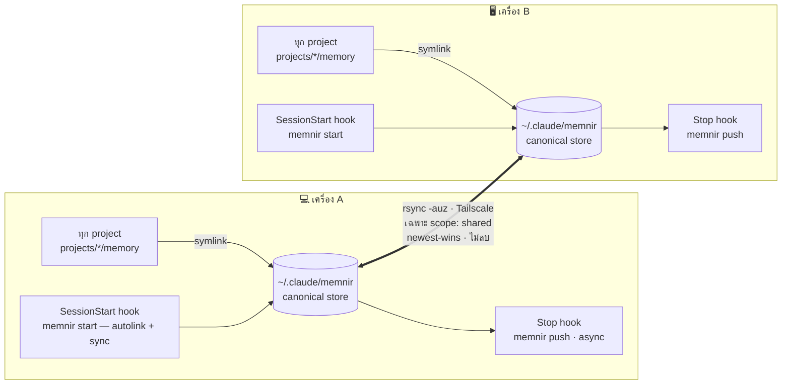

#  Memnir

[](https://github.com/MegaWiz-Dev-Team/memnir/releases)
[](LICENSE)


*memory + [Mímir](https://en.wikipedia.org/wiki/M%C3%ADmir)* — share memory ของ [Claude Code](https://docs.claude.com/en/docs/claude-code) ข้าม **เครื่อง** และ **ทุก session** แบบ peer-to-peer ผ่าน [Tailscale](https://tailscale.com) ไม่ผ่าน cloud

> 🇬🇧 [English](README.md)

Claude Code เก็บ memory แยกตาม project ที่ `~/.claude/projects/<encoded-path>/memory/` ผูกกับเครื่องและ working dir เดียว — เปิดอีกเครื่องหรืออีก project ก็ไม่เห็นกัน Memnir รวมเป็น **pool เดียว** ที่ทุก session ทุกเครื่องใช้ร่วมกัน และ sync เฉพาะ memory ที่คุณเลือกระหว่างเครื่อง

## สถาปัตยกรรม



1. **Store** — `~/.claude/memnir/` ไฟล์จริงอยู่ที่เดียวต่อเครื่อง
2. **Symlink** — `memory/` ของทุก project ชี้มาที่นี่ → ทุก session ใช้ pool เดียว
3. **Sync** — two-way `rsync` ผ่าน Tailscale กรองตาม scope

## ติดตั้ง

Memnir เป็น **Rust single binary** (pure std ไม่มี dep ภายนอก) บนแต่ละเครื่อง:

```bash
git clone https://github.com/MegaWiz-Dev-Team/memnir
cd memnir
./install.sh
```

`install.sh` จะ `cargo build --release` → ติดตั้ง binary ที่ `~/.local/bin/memnir`, ตั้ง alias, symlink ทุก project เข้า pool, ติดตั้ง auto-sync hooks, ถาม peer

> ไม่มี cargo แต่ arch เดียวกัน (Apple Silicon)? build ที่เครื่องหนึ่งแล้ว `scp target/release/memnir อีกเครื่อง:.local/bin/`

แต่ละ release แนบ prebuilt binary สำหรับ **macOS** (arm64 + Intel) และ **Linux x86_64** (ที่ WSL2 ใช้) — ดู [Releases](https://github.com/MegaWiz-Dev-Team/memnir/releases) · `install.sh` จะรัน **preflight** ก่อน ถ้าขาด prerequisite จะ exit โดยไม่แตะอะไรเลยและบอกว่าต้องลงอะไรบ้าง

### Linux / WSL2

โค้ด Rust เป็น POSIX และ build บน WSL2 (Ubuntu) ได้ตรง ๆ · `install.sh` ตรวจเจอ WSL2 แล้วใส่ alias ลง `~/.bashrc` แทน `~/.zshrc` และใช้ `rsync`/`ssh` ตัวเดียวกัน

```bash
sudo apt-get update && sudo apt-get install -y rsync openssh-client python3 build-essential
curl --proto '=https' --tlsv1.2 -sSf https://sh.rustup.rs | sh -s -- -y && . "$HOME/.cargo/env"

git clone https://github.com/MegaWiz-Dev-Team/memnir && cd memnir
./install.sh
```

> ⚠️ **รัน Claude Code *ใน* WSL2** · memnir จัดการ `~/.claude/memnir` ใน WSL home · Windows desktop app เก็บ memory ที่ `C:\Users\<you>\.claude` (`/mnt/c/Users/<you>/.claude` จาก WSL) ซึ่ง **ไม่ได้** bridge ไว้ ถ้าติดตั้ง hooks จาก WSL จะไปลงผิด `settings.json` · `install.sh` จะเตือนถ้าเจอเคสนี้

### ตั้งค่า peers (mesh)

แต่ละเครื่องลิสต์ **เครื่องอื่นทั้งหมด** — บรรทัดละ `user@tailscale-host` (2 เครื่อง = บรรทัดเดียว, N เครื่อง = mesh เต็ม):

```bash
printf '%s\n' 'you@mac-b' 'you@mac-c' > ~/.claude/memnir.conf
# หรือ:  export MEMNIR_PEER="you@mac-b,you@mac-c"
```

`push`/`pull` วิ่งทุก peer (newest-wins, ไม่ลบ) · ไม่มี hostname ฝังใน binary · แต่ละคู่ต้องมี SSH key + Remote Login สองทิศ

### Origin tracking (memory มาจากเครื่องไหน)

memory แต่ละก้อนมี `metadata.origin: <hostname>` = เครื่องที่เขียนมันก้อนแรก Memnir stamp ตอนเขียนใหม่ก่อน push (ของเดิม grandfather เป็น `?`) ดูได้ที่ `memnir status`/`doctor` (บรรทัด `origins:`), `memnir list` (โชว์ origin ต่อ shared memory), และ dashboard panel **Origins** + tooltip ของ node (`· from <เครื่อง>`)

## วิธีใช้

### ปกติ: ไม่ต้องทำอะไร

หลัง `./install.sh` Memnir ทำงาน **อัตโนมัติทุก session** ผ่าน hooks — เปิด Claude = ดึง memory ล่าสุด + autolink; Claude เขียน memory = push ออกหลังจบ turn

### งานที่ทำเอง

```bash
memnir share project_firestore_envs   # ตั้งเป็น shared (default = local) + push
memnir local debug_scratch_today      # ถอด tag → local (ไม่ sync)
memnir list                           # ดูว่าอันไหน shared / local
memnir sync                           # sync เอง (hook ทำให้แล้ว)
memnir doctor                         # health + token footprint + สิ่งที่ควรแก้
memnir dash && open ~/.claude/memnir/dashboard.html   # dashboard (graph + token)
memnir link                           # ใส่ project ปัจจุบันเข้า pool เดี๋ยวนี้
```

### คำสั่งทั้งหมด

| คำสั่ง | ทำอะไร |
|---|---|
| `memnir sync` | push + pull เฉพาะ `scope: shared` + regen index |
| `memnir push` / `pull` | ทิศเดียว (shared เท่านั้น) |
| `memnir share <id>` | ตั้ง memory เป็น shared + push |
| `memnir local <id>` | ถอด tag → local (ไม่ sync) |
| `memnir list` | shared vs local |
| `memnir reserve <repo> [<version>\|--patch\|--minor\|--major] [desc]` | จอง version ก่อนขึ้น feature/issue ใหม่ (ดู [จอง version](#จอง-version-)); ไม่ใส่ version/flag → minor ถัดไป |
| `memnir reservations [repo] [--all]` | ดูรายการจองที่ active (จัดกลุ่มตาม repo + owner/อายุ/desc) พร้อมเตือน collision |
| `memnir release <repo> <version>` | ปล่อยคืนเมื่องานขึ้นเสร็จแล้ว |
| `memnir status` | store / counts / peer |
| `memnir help` | ดูคำสั่งทั้งหมด (หรือ `-h` / `--help`) |
| `memnir start` | autolink + sync (SessionStart hook เรียก) |
| `memnir link` | symlink project ปัจจุบันเข้า pool |
| `memnir doctor [--check]` | health + actions (`--check` = เงียบถ้าไม่มีปัญหา ใช้ใน hook) |
| `memnir compact-index [types] [--off]` | ลด token ของ index ที่โหลดทุก session — เก็บเฉพาะ Tier-0 ใน `MEMORY.md` ที่เหลือย้ายไป `MEMORY.full.md` (ดู [Token footprint](#token-footprint-)) |
| `memnir fix-links [--apply]` | ซ่อม `[[links]]` ที่เสียซึ่งมีปลายทางชัดเจนตัวเดียว (dry-run ถ้าไม่ใส่ `--apply`) |
| `memnir autolink` | symlink project ปัจจุบันเข้า pool แบบเงียบ (ถ้า link แล้วไม่พิมพ์อะไร ใช้ใน hook) |
| `memnir dash` | สร้าง `dashboard.html` แบบ static (graph + token viz) |
| `memnir serve [--port N]` | dashboard **กดสั่งงานได้** บน `127.0.0.1` — คลิก node = toggle shared/local, ปุ่ม sync |

### Interactive dashboard

`memnir serve` รัน HTTP server เล็กๆ บน localhost (pure std) แล้วเปิด browser — ต่างจาก `dash` static ตรงที่**สั่งงานได้**:

- **คลิก node** → toggle memory นั้น shared ↔ local (ถ้าเป็น shared จะ push ให้)
- ปุ่ม **⟳ Sync** → sync สองทิศกับ peer
- **Refresh** → โหลดข้อมูลใหม่

bind `127.0.0.1` เท่านั้น + มี token สุ่มต่อ session ใน URL กัน CSRF หยุดด้วย `Ctrl-C`

`<id>` = ชื่อ memory ใส่ `.md` หรือไม่ก็ได้

## Scope: shared vs local 🔑

Memnir sync **เฉพาะที่ตั้งใจสื่อสารข้ามเครื่อง** ไม่ใช่ทั้งหมด คุมด้วย frontmatter:

```yaml
---
name: project_firestore_envs
metadata:
  type: project
  scope: shared      # <- มีบรรทัดนี้ = sync ข้ามเครื่อง
---
```

- **`scope: shared`** → sync สองทิศ
- **ไม่มี `scope`** (default) → **local** อยู่เครื่องเดียว
- `MEMORY.md` **ไม่ sync** — regen ใหม่ทุกเครื่องจากไฟล์ที่มีจริง → title ของ local ไม่รั่ว
- toggle: `memnir share <id>` / `memnir local <id>`

## Token footprint 🪙

มี **อย่างเดียวที่ always-on**: `MEMORY.md` (index) — Claude Code โหลดเข้า context ทุก session ส่วนที่เหลือ (เนื้อ memory ทั้ง pool) เป็น **on-demand**: `memnir search` อ่านไฟล์ตรงๆ ดังนั้น catalog เต็มๆ กิน **0 token** จนกว่าจะ query จริง

`MEMORY.md` มี 1 บรรทัดต่อ 1 memory → โตตามจำนวน memory พอถึงหลักร้อยตัวมันกิน context ประจำเยอะ `memnir doctor` จะขึ้น 🔴 เมื่อเกิน ~12k tokens มี 2 คำสั่งช่วยให้มันเล็ก:

### `memnir compact-index` — Tier-0 split

```bash
memnir compact-index            # MEMORY.md = เฉพาะ user + feedback
memnir compact-index user feedback project   # กำหนด Tier-0 เอง
memnir compact-index --off      # คืนค่า index เต็ม
```

- `MEMORY.md` เก็บเฉพาะ **Tier-0** (default `user,feedback` — ตัวที่ควรพกทุก session)
- catalog เต็มย้ายไป `MEMORY.full.md` — **ไม่ auto-load** แต่ยังอยู่บนดิสก์และ **search เจอครบ** (`search` ทำงานบน pool ไม่ใช่ index → ไม่มีอะไรหาย)
- กลับได้ทุกเมื่อด้วย `--off`; index regen จากไฟล์ memory จริงเสมอ → ไม่มีข้อมูลหาย `MEMORY.full.md` เป็น local-only (ไม่ sync เหมือน `MEMORY.md`)
- Tier-0 ที่ใช้อยู่จำไว้ใน marker `.index_compact` → `sync`/`pull`/`share` จะ regen แบบ compact ต่อ ไม่ขยายกลับ

### `memnir fix-links` — ซ่อม `[[links]]` ที่เสีย

```bash
memnir fix-links            # dry-run: list link เสีย + ตัวที่จะแก้
memnir fix-links --apply    # เขียนแก้เฉพาะตัวที่ชัดเจน
```

`[[link]]` "เสีย" = ไม่มี memory ตรงกัน `fix-links` แก้ให้เฉพาะกรณีมีปลายทาง normalized-substring ที่ตรง **ตัวเดียว** เท่านั้น typo และ forward-reference (ตั้งใจ `[[name]]` ของ memory ที่ยังไม่เขียน) จะถูก list ไว้แต่ **ไม่แตะ**

## จอง version 🔖

เวลาหลาย session (เครื่องเดียวกัน หรือคนละเครื่องบน mesh) ทำงาน repo **เดียวกัน** พร้อมกัน สอง session อาจหยิบ "version ถัดไป" ชนกันได้ ให้จอง version **ก่อน** เริ่ม feature/issue ใหม่ เพื่อให้ทุก session เห็นว่ามีอะไรกำลังทำอยู่:

```bash
memnir reserve Mimir "OCR retry queue"      # → MINOR ถัดไป (เช่น 0.5.0)
memnir reserve Mimir --patch "fix index"    # → PATCH ถัดไป
memnir reserve heimdall 2.4.0 "tool-call"   # → ระบุ version ตรง ๆ
memnir reservations                          # ใครจองอะไร (⚠ เตือน collision)
memnir release Mimir 0.5.0                    # ปล่อยคืนเมื่องานขึ้นเสร็จ
```

ไม่ใส่ version/flag → จอง **minor** ถัดไป; `--patch` / `--major` (และ `--next` = alias ของ `--minor`) เลือกชนิดการ bump ถ้าระบุ version ที่เครื่องอื่นจองไว้แล้วจะ **ถูกปฏิเสธ**

การจองแต่ละครั้งเป็น **ไฟล์ `scope: shared` ของตัวเอง** (มี tag สุ่มสั้น ๆ) → sync แยกกันได้ ไม่โดน newest-wins ทับ และถ้ามีคนจอง version เดียวกันซ้ำ ไฟล์ทั้งสองจะอยู่ครบและถูก **โชว์เป็น `COLLISION`** (ใน `reservations` และ `doctor`) แทนที่จะหายเงียบ ๆ — เป็น **การประสานแบบ best-effort ไม่ใช่ distributed lock**: ช่วง sync ยังมีโอกาส race ได้ แต่ race จะถูกทำให้เห็น ไม่ซ่อน `release` ตั้ง `status: released` (เป็น tombstone — ตัว sync ไม่เคยลบไฟล์) ส่วนไฟล์การจองจะไม่ไปรกใน index ที่โหลดทุก session, `list`, และ dashboard graph; `doctor` / `status` รายงานจำนวนการจองที่ active + จำนวน collision แทน

## ออกแบบ sync

- `rsync -auz`: `-u` = newest-wins, **ไม่มี `--delete`** → ไม่ลบข้ามเครื่อง (ลบต้องทำทั้งสองฝั่ง)
- ของเดิมก่อน symlink backup เป็น `memory.bak.<ts>`
- log ที่ `~/.claude/memnir.log`

## Requirements (macOS / WSL2)

> ✅ **รองรับ macOS และ Linux / WSL2** — `install.sh` ตรวจ platform แล้วเลือก shell rc, dependencies, binary ให้เอง · ดู [Linux / WSL2](#linux--wsl2) ข้างบน · binary พึ่ง Unix symlink, `/dev/urandom`, `hostname` + ต้องมี `rsync`/`ssh`/Tailscale สำหรับ sync
>
> ⚠️ **Windows native** ยังไม่รองรับ — `src/main.rs` ใช้ `std::os::unix::fs::symlink` ตรง ๆ คอมไพล์บน Windows ไม่ผ่าน ต้อง port (symlink→junction, ลง rsync, `USERPROFILE`) · ใช้ **WSL2** แทน และรัน Claude Code ใน WSL ให้ memory อยู่ที่ WSL `~/.claude`

ต้องมี: macOS หรือ Linux/WSL2 (x86_64), **Rust/cargo** (build — WSL2 ต้องมี `build-essential` ด้วยสำหรับ linker `cc`) หรือ prebuilt binary ของ platform นั้นจาก Releases, shell rc (`~/.zshrc` บน macOS / `~/.bashrc` บน WSL2 — `install.sh` เลือกให้), rsync+ssh, python3 (install.sh merge hooks), **Tailscale** ทั้งสองเครื่อง (Mac app บน macOS / Linux client บน WSL2), **Remote Login** เปิดฝั่งปลายทาง, **SSH key auth** ระหว่างเครื่อง, **peer** ที่ `~/.claude/memnir.conf`

**หมายเหตุ macOS:**
- `systemsetup -setremotelogin on` ต้องมี Full Disk Access → ใช้ GUI toggle (Sharing) ง่ายกว่า
- Tailscale SSH server (`tailscale up --ssh`) **ใช้ไม่ได้บน macOS** (Linux เท่านั้น) → ใช้ Remote Login ปกติ

## License

[MIT](LICENSE)
