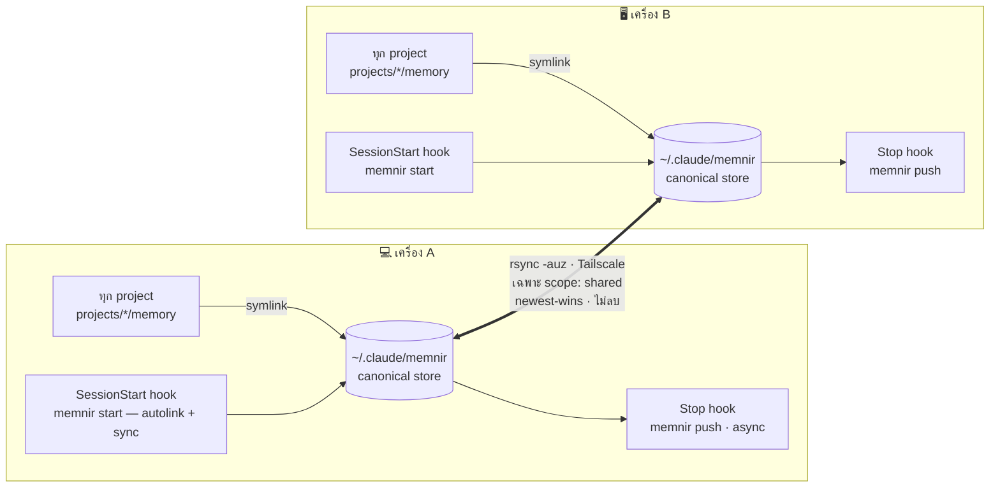

#  Memnir

*memory + [Mímir](https://en.wikipedia.org/wiki/M%C3%ADmir)* — share memory ของ [Claude Code](https://docs.claude.com/en/docs/claude-code) ข้าม **เครื่อง** และ **ทุก session** แบบ peer-to-peer ผ่าน [Tailscale](https://tailscale.com) ไม่ผ่าน cloud

> 🇬🇧 [English](README.md)

Claude Code เก็บ memory แยกตาม project ที่ `~/.claude/projects/<encoded-path>/memory/` ผูกกับเครื่องและ working dir เดียว — เปิดอีกเครื่องหรืออีก project ก็ไม่เห็นกัน Memnir รวมเป็น **pool เดียว** ที่ทุก session ทุกเครื่องใช้ร่วมกัน และ sync เฉพาะ memory ที่คุณเลือกระหว่างเครื่อง

## สถาปัตยกรรม



1. **Store** — `~/.claude/memnir/` ไฟล์จริงอยู่ที่เดียวต่อเครื่อง
2. **Symlink** — `memory/` ของทุก project ชี้มาที่นี่ → ทุก session ใช้ pool เดียว
3. **Sync** — two-way `rsync` ผ่าน Tailscale กรองตาม scope

## ติดตั้ง

Memnir เป็น **Rust single binary** (pure std ไม่มี dep ภายนอก) บนแต่ละเครื่อง:

```bash
git clone https://github.com/MegaWiz-Dev-Team/memnir
cd memnir
./install.sh
```

`install.sh` จะ `cargo build --release` → ติดตั้ง binary ที่ `~/.local/bin/memnir`, ตั้ง alias, symlink ทุก project เข้า pool, ติดตั้ง auto-sync hooks, ถาม peer

> ไม่มี cargo แต่ arch เดียวกัน (Apple Silicon)? build ที่เครื่องหนึ่งแล้ว `scp target/release/memnir อีกเครื่อง:.local/bin/`

### ตั้งค่า peer

แต่ละเครื่องต้องรู้ peer (อีกเครื่อง) ตั้งครั้งเดียว:

```bash
echo 'you@other-mac' > ~/.claude/memnir.conf      # user@tailscale-host ของอีกเครื่อง
# หรือ:  export MEMNIR_PEER=you@other-mac
```

ไม่มี hostname ฝังใน binary

## วิธีใช้

### ปกติ: ไม่ต้องทำอะไร

หลัง `./install.sh` Memnir ทำงาน **อัตโนมัติทุก session** ผ่าน hooks — เปิด Claude = ดึง memory ล่าสุด + autolink; Claude เขียน memory = push ออกหลังจบ turn

### งานที่ทำเอง

```bash
memnir share project_firestore_envs   # ตั้งเป็น shared (default = local) + push
memnir local debug_scratch_today      # ถอด tag → local (ไม่ sync)
memnir list                           # ดูว่าอันไหน shared / local
memnir sync                           # sync เอง (hook ทำให้แล้ว)
memnir doctor                         # health + token footprint + สิ่งที่ควรแก้
memnir dash && open ~/.claude/memnir/dashboard.html   # dashboard (graph + token)
memnir link                           # ใส่ project ปัจจุบันเข้า pool เดี๋ยวนี้
```

### คำสั่งทั้งหมด

| คำสั่ง | ทำอะไร |
|---|---|
| `memnir sync` | push + pull เฉพาะ `scope: shared` + regen index |
| `memnir push` / `pull` | ทิศเดียว (shared เท่านั้น) |
| `memnir share <id>` | ตั้ง memory เป็น shared + push |
| `memnir local <id>` | ถอด tag → local (ไม่ sync) |
| `memnir list` | shared vs local |
| `memnir status` | store / counts / peer |
| `memnir start` | autolink + sync (SessionStart hook เรียก) |
| `memnir link` | symlink project ปัจจุบันเข้า pool |
| `memnir doctor [--check]` | health + actions (`--check` = เงียบถ้าไม่มีปัญหา ใช้ใน hook) |
| `memnir dash` | สร้าง `dashboard.html` แบบ static (graph + token viz) |
| `memnir serve [--port N]` | dashboard **กดสั่งงานได้** บน `127.0.0.1` — คลิก node = toggle shared/local, ปุ่ม sync |

### Interactive dashboard

`memnir serve` รัน HTTP server เล็กๆ บน localhost (pure std) แล้วเปิด browser — ต่างจาก `dash` static ตรงที่**สั่งงานได้**:

- **คลิก node** → toggle memory นั้น shared ↔ local (ถ้าเป็น shared จะ push ให้)
- ปุ่ม **⟳ Sync** → sync สองทิศกับ peer
- **Refresh** → โหลดข้อมูลใหม่

bind `127.0.0.1` เท่านั้น + มี token สุ่มต่อ session ใน URL กัน CSRF หยุดด้วย `Ctrl-C`

`<id>` = ชื่อ memory ใส่ `.md` หรือไม่ก็ได้

## Scope: shared vs local 🔑

Memnir sync **เฉพาะที่ตั้งใจสื่อสารข้ามเครื่อง** ไม่ใช่ทั้งหมด คุมด้วย frontmatter:

```yaml
---
name: project_firestore_envs
metadata:
  type: project
  scope: shared      # <- มีบรรทัดนี้ = sync ข้ามเครื่อง
---
```

- **`scope: shared`** → sync สองทิศ
- **ไม่มี `scope`** (default) → **local** อยู่เครื่องเดียว
- `MEMORY.md` **ไม่ sync** — regen ใหม่ทุกเครื่องจากไฟล์ที่มีจริง → title ของ local ไม่รั่ว
- toggle: `memnir share <id>` / `memnir local <id>`

## ออกแบบ sync

- `rsync -auz`: `-u` = newest-wins, **ไม่มี `--delete`** → ไม่ลบข้ามเครื่อง (ลบต้องทำทั้งสองฝั่ง)
- ของเดิมก่อน symlink backup เป็น `memory.bak.<ts>`
- log ที่ `~/.claude/memnir.log`

## Requirements (macOS เท่านั้น)

> ⚠️ รองรับ **macOS เท่านั้น** (พึ่ง `hostname -s`, BSD `sed -i ''`, `~/.zshrc`, Tailscale.app, Remote Login) ยังไม่รองรับ Linux/Windows

ต้องมี: macOS, **Rust/cargo** (build) หรือ prebuilt binary ข้ามเครื่อง Apple Silicon, zsh, rsync+ssh (มากับ macOS), python3 (install.sh merge hooks), **Tailscale Mac app** ทั้งสองเครื่อง, **Remote Login** เปิดฝั่งปลายทาง, **SSH key auth** ระหว่างเครื่อง, **peer** ที่ `~/.claude/memnir.conf`

**หมายเหตุ macOS:**
- `systemsetup -setremotelogin on` ต้องมี Full Disk Access → ใช้ GUI toggle (Sharing) ง่ายกว่า
- Tailscale SSH server (`tailscale up --ssh`) **ใช้ไม่ได้บน macOS** (Linux เท่านั้น) → ใช้ Remote Login ปกติ

## License

[MIT](LICENSE)
